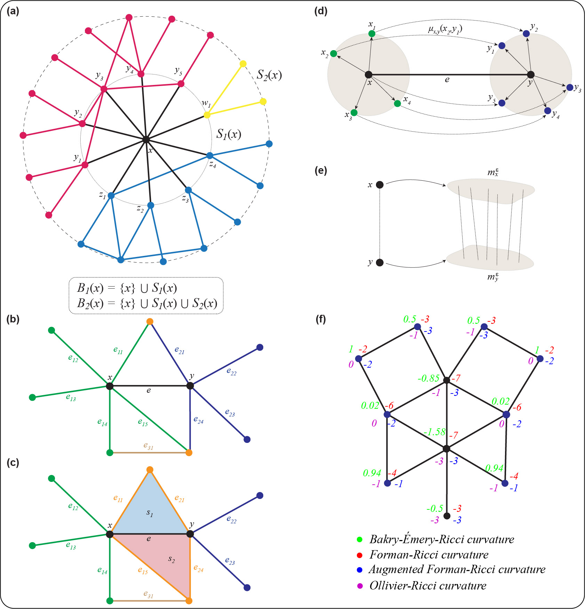

# Curvature-BERC

## About
This repository contains the codes and data associated with the following manuscript:  

Madhumita Mondal, Areejit Samal*, Florentin Münch*, and Jürgen Jost*, <i>Bakry-Émery-Ricci curvature: An alternative network geometry measure in the expanding toolbox of graph Ricci curvatures. </i>  
(* Corresponding author)

The repository contains three folders: Code, Data, and Figures. A description of the files contained in each folder is provided below.

## Code: 
Contains all the necessary codes to reproduce the results in the manuscript.

1. Compute_HGG.sh: Shell script to generate Hyperbolic random graph.

2. FormanUndirected.cpp: C++ code to calculate Forman-Ricci curvature of an undirected network.

3. FormanTriangleUndirected.cpp: C++ code to calculate Augmented Forman-Ricci curvature of an undirected network.

4. OR_NotNorm.py: Python code to calculate the Non-normalized Ollivier-Ricci curvature of an undirected network.

5. BERC_edgelist.ipynb: Mathematica code to calculate Bakry-Emery-Ricci curvature of an undirected network.

6. Compute_Curvatures.sh: Shell script to calculate Forman, Augmented Forman, and Ollivier Ricci curvatures together.

7. Robustness.py: Python code to calculate the robustness of a given network.

8. Model_Networks.ipynb: To generate model network and calculate the correlation between the vertex measures and robustness.

9. Plot_Model_Networks.ipynb: To generate the plots corresponding to model networks.

10. Real_Networks.ipynb: To calculate the correlation between the vertex measures and the robustness of real networks.

11. Plot_Real_Networks.ipynb: To generate the plots corresponding to real networks.

## Data: 
Contains necessary data to obtain the plots

1. Model_Networks: Contains data for model networks.

2. Real_Networks: Contains data for real networks.

## Figures: 

Contains all the plots present in the manuscript (can be generated by Plot_Model_Networks.ipynb and Plot_Real_Networks.ipynb)
